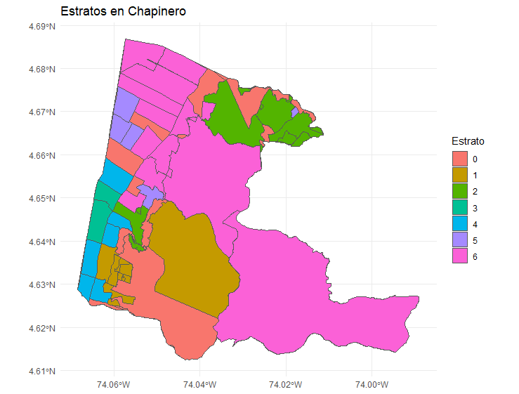
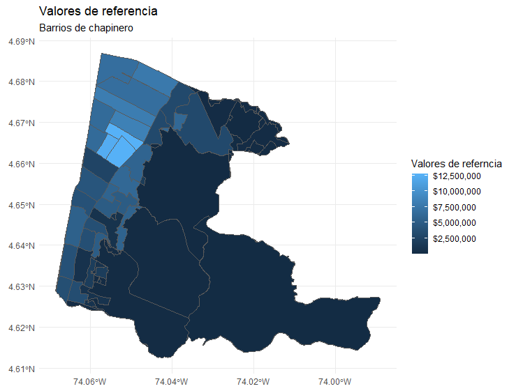

```{r setup, include=FALSE,warning=FALSE,message=FALSE,echo=FALSE}

library(openxlsx)
library(readxl)
library(sf)
library(leaflet)
library(dplyr)
library(viridis)
library(tidyverse)
library(tidyverse)
library(tidytext)
library(broom)
library(randomForest)
library(raster)
library(caret)
library(pacman)
library(nnet)

options(scipen = 999)

knitr::opts_chunk$set(echo = TRUE)

```


\section{Introducción} 
Una nueva start-up en el sector inmobiliario busca establecer una estrategia sólida para la compra y venta de propiedades en Chapinero, Bogotá. Su principal objetivo es adquirir la mayor cantidad de inmuebles en esta zona estratégica mientras optimiza los costos y minimiza los riesgos. Para ello, han solicitado el desarrollo de un modelo predictivo que permita tomar decisiones fundamentadas y maximizar el rendimiento de sus inversiones.

Uno de los desafíos más significativos es la falta de información detallada sobre las propiedades en Chapinero, lo que dificulta la estimación precisa de precios y la definición de estrategias efectivas. Además, la empresa está alerta ante los riesgos asociados al uso de modelos predictivos en el sector, recordando casos como el de Zillow, donde la sobreestimación de precios derivó en pérdidas millonarias y un impacto negativo en su operación. Este proyecto busca superar tales desafíos mediante el desarrollo de un modelo robusto, adaptado a las limitaciones de datos, que garantice predicciones confiables y facilite una toma de decisiones eficiente y sostenible.

La literatura existente subraya la relevancia de aplicar enfoques avanzados de machine learning para mejorar la precisión en la predicción de precios de vivienda. Por ejemplo, Truong et al. (2020) destacaron cómo técnicas como la regresión híbrida y la generalización apilada combinan estrategias como Random Forest, XGBoost y LightGBM para manejar datos complejos, reducir errores y equilibrar el sesgo y la varianza en los modelos. Estas metodologías resultan clave para prevenir errores costosos y asegurar resultados sostenibles.

Por su parte, Adetunji et al. (2022) demostraron que el algoritmo Random Forest es particularmente eficaz para predecir precios de viviendas al considerar factores como ubicación, tamaño y condiciones físicas. Asimismo, investigaciones como las de Varma et al. (2018) han explorado las ventajas de combinar diferentes métodos de predicción para obtener estimaciones más precisas. Inspirados en estos avances, este proyecto aprovechará los conocimientos existentes para construir un modelo predictivo que se ajuste de manera óptima al contexto de Chapinero y sus particularidades.  


\section{Datos}


La base de datos utilizada para este proyecto se construyó a partir de múltiples fuentes de información con el objetivo de desarrollar un modelo predictivo para estimar los precios de propiedades en el barrio de Chapinero en Bogotá. Los datos incluyen tanto atributos estructurales como contextuales, que permiten capturar la heterogeneidad de las propiedades en la ciudad. El proceso de construcción de la base de datos incluyó las siguientes etapas:

\subsection{Extracción de atributos estructurales a partir de descripciones textuales}

Se utilizó la API de OpenAI para procesar los textos del título y la descripción de cada propiedad, de donde se extrajeron las siguientes variables:

\begin{itemize}

\item  \textbf{Metros cuadrados de las viviendas:} Esta es una de las variables más importantes en la valoración inmobiliaria. El tamaño de una propiedad tiene una relación directa con su precio, ya que representa la superficie habitable disponible. Propiedades más grandes suelen ser más costosas, aunque el impacto del tamaño puede variar dependiendo del barrio y la categoría de la vivienda.

\item  \textbf{Número de cuartos:} El número de habitaciones es un factor determinante en la funcionalidad de una vivienda. En zonas urbanas densamente pobladas como Chapinero, una mayor cantidad de cuartos tiende a incrementar el precio de la propiedad, ya que aumenta su atractivo para familias o grupos que necesitan espacio adicional.

\item  \textbf{Cuenta con parqueadero:} Este un factor crucial en áreas urbanas densamente pobladas, donde el espacio es limitado y el estacionamiento es escaso. Contar con un parqueadero privado puede agregar un valor considerable a una propiedad, ya que proporciona una solución práctica y segura para los residentes que poseen vehículos.

\item  \textbf{Cuenta con ascensor:}  Esta característica especialmente relevante en edificios altos, donde su ausencia podría limitar el acceso a pisos superiores, particularmente para personas mayores o con movilidad reducida. Un ascensor mejora la accesibilidad, facilita el transporte de objetos pesados y eleva el nivel de confort para los residentes. 

\item  \textbf{Categoría:} Se clasificaron las propiedades en apartaestudios, apartamentos, casas, penthouses u otros. Esto permite capturar diferencias significativas en el mercado. Cada categoría responde a diferentes segmentos de demanda, y sus precios reflejan las características específicas de cada tipo de vivienda, como lujo, tamaño, o ubicación dentro de la ciudad.

\end{itemize}

\subsection{Enriquecimiento de datos con fuentes externas:}

\begin{itemize}

\item  \textbf{Estrato socioeconómico:} Este es un indicador clave en la valoración de propiedades en Colombia, ya que está asociado con la calidad de los servicios públicos, la infraestructura del barrio y el nivel socioeconómico de los residentes. Estratos más altos generalmente corresponden a precios más altos debido a la percepción de mayor calidad de vida y mejores servicios.

\item  \textbf{Valor de referencia del metro cuadrado por manzana:} Este valor representa la mediana del precio por metro cuadrado en cada manzana y proporciona un indicador robusto del nivel de precios en la zona. Es una medida crucial para capturar las variaciones espaciales en el valor del suelo urbano, lo cual es fundamental para predecir los precios de las propiedades.

\item  \textbf{Área construida m2 por manzana:} La densidad de construcción en una manzana puede influir en el precio de las propiedades, ya que refleja la intensidad de uso del suelo. Zonas con alta densidad construida suelen tener mayor actividad comercial y de servicios, lo que puede aumentar el valor de las propiedades residenciales.

\item  \textbf{Cantidad de predios residenciales por manzana:} Esta variable indica el nivel de urbanización y la composición residencial de la zona. Un mayor número de predios residenciales puede estar asociado con áreas más consolidadas y deseables para vivir, lo cual impacta positivamente en el valor de las propiedades.


\end{itemize}

\subsection{ Análisis descriptivo de los datos}

En esta sección se presentan las estadísticas descriptivas de las principales variables utilizadas en el análisis de las propiedades inmobiliarias. Las estadísticas descriptivas proporcionan una visión general de la distribución y variabilidad de los datos, lo que ayuda a comprender mejor las características fundamentales de las propiedades y su contexto urbano. 

La base de datos de entrenamiento contiene un total de 38,644 observaciones, lo que proporciona una muestra robusta para el análisis y la predicción. De esta base de datos, se seleccionaron 10,286 propiedades para predecir su precio, lo que constituye una muestra representativa para realizar las estimaciones y ajustar los modelos de predicción del valor de las propiedades.

```{r echo=FALSE, message=FALSE, warning=FALSE}
# Cargar librerías necesarias
library(tibble)  
library(knitr)  
library(kableExtra)  

# Leer el archivo .rds
data <- readRDS("est_descriptivas.rds")

data %>%
  as_tibble() %>%
  kable("latex", booktabs = TRUE, longtable = TRUE) %>%
  kable_styling(latex_options = c("striped", "hold_position"))

```

La tabla presenta estadísticas descriptivas de cuatro variables inmobiliarias. La variable metros cuadrados (m2) tiene un promedio de 445 m², con una alta variabilidad reflejada en una desviación estándar de 1,971 m². El tamaño mínimo registrado es de 30 m², mientras que el máximo alcanza los 29,890 m², indicando la presencia de propiedades muy diversas en tamaño. El número de cuartos (n_cuartos) promedio es de 3, con una desviación estándar de 2 cuartos, lo que sugiere que la mayoría de las viviendas están diseñadas para familias pequeñas o medianas. El rango oscila entre 1 y 80 cuartos, destacando la diversidad en la capacidad de las propiedades.

Los metros cuadrados construidos por manzana (m2_manzana) tienen un promedio de 25,300 m² y una desviación estándar de 28,791 m², mostrando diferencias significativas en la densidad de construcción. El mínimo registrado es de 24 m² y el máximo de 243,793 m². Finalmente, el número de predios residenciales por manzana (n_predios_manzana) tiene un promedio de 245 predios, con una desviación estándar de 319. El número mínimo de predios es 1, mientras que el máximo alcanza 4,543, indicando áreas con alta densidad residencial.

```{r, echo=FALSE, out.width="100%"}
# Cargar la imagen en el documento


```

```{r, echo=FALSE, out.width="100%"}
# Cargar la imagen en el documento


```

En cuanto a la distribución de estratos en el barrio de Chapinero, los datos muestran una representación variada de los estratos socioeconómicos. Este análisis es fundamental para comprender cómo se distribuyen las propiedades en función de su ubicación y estrato, lo que puede tener un impacto directo en los precios de las propiedades. Además, se analizó el valor de referencia de los metros cuadrados por manzana en Chapinero. Este valor es crucial para entender las tendencias de precios en la zona y se utiliza como un indicador de referencia para comparar las propiedades dentro de esta área urbana. Tanto la distribución de los estratos como el valor de referencia se visualizan claramente en los mapas generados, lo que permite identificar patrones espaciales y diferencias geográficas significativas en estos aspectos dentro del barrio de Chapinero.


\section{Modelos y resultados} 


Con base en las variables identificadas como relevantes para la predicción de precios en esta localidad, se desarrollaron varios modelos con el objetivo de ajustar de manera óptima las estimaciones a las características del problema. En este ejercicio se implementaron modelos de regresión lineal, red elástica, árboles aleatorios, técnicas de boosting y redes neuronales. Entre estos enfoques, el modelo que mostró el mejor desempeño fue XGBoost, por lo que se profundizará en los resultados obtenidos con esta metodología.

\subsection{XgBoost} 

Este es un método de aprendizaje supervisado que se basa en árboles de decisión potenciados por gradiente. Una de las principales ventajas de este modelo es la escabilidad a grandes volúmenes de datos. 

\subsection{Estimación}

Matemáticamente, podemos expresar nuestro modelo de la siguiente manera:

\[
\hat{y}_{i} = \sum_{k=1}^{K} f_k(x_i), \quad f_k \in \mathcal{F}
\]

Donde:
\begin{itemize}
    \item \( K \) es el número de árboles.
    \item \( f_k \) representa el espacio funcional de \( \mathcal{F} \).
    \item \( \mathcal{F} \) es el conjunto de posibles CARTs.
     \item  \(\hat{y}_{i}\) Representa el precio de la vivienda a predecir. 

\end{itemize}

La función objetivo asociada a este modelo se define como:

\[
\text{obj}(\theta) = \sum_{i=1}^{n} l(y_{i}, \hat{y}_{i}) + \sum_{k=1}^{K} \Omega(f_{k})
\]

Donde:
\begin{itemize}
    \item \( l(y_{i}, \hat{y}_{i}) \) es la función de pérdida que mide la discrepancia entre los valores reales \( y_i \) y las predicciones \( \hat{y}_i \).
    \item \( \Omega(f_k) \) es un término de regularización que controla la complejidad de los árboles, ayudando a prevenir el sobreajuste.
\end{itemize}


En este contexto, XGBoost utiliza esta estructura matemática para optimizar las predicciones mediante el ajuste iterativo de los árboles de decisión. Cada árbol corrige los errores cometidos por los árboles previos, lo que permite al modelo alcanzar un equilibrio entre sesgo y varianza, y producir estimaciones más precisas. Esta característica lo convierte en una herramienta altamente eficaz para problemas de predicción complejos.


\subsubsection{Parámetros de XGboost}

Los principales parámetros de xgboost que permiten optimizar el modelo son los siguientes: 

\begin{itemize} 
  \item Tasa de aprendizaje: Este parámetro es útil para controlar la rapidez del algoritmo gracias al descenso del gradiente. De esta forma, este valor entre más pequeño que sea garantiza una mayor precisión, dado que permite encontrar el punto de óptimización con mayor precisión. No obstante, tiene asociado un costo computacional. 
  \item Profundidad máxima de los árboles: Controla la complejidad de los árboles para ajustar o evitar el sobreajustre. 
  \item Gamma: Umbral para reducir la pérdida y evitar divisiones innecesarias.
  \item Submuestra: Este parámetro es útil para controlar el porcentaje de observaciones usados para cada iteración. 
  \item Parámetros de regularización: 
    \begin{itemize}
    \item Lambda: Penalización para reducir sobreajuste. 
    \item Alpha: Penalización para manejar características irrelevantes.
    \end{itemize}
\end{itemize}

Para la obtención de los parámetros óptimos, se realiza una red en la que se permita la iteración entre los parámetros que la literatura considera pertinentes. Para evaluar la pertinencia de cada uno de estos parámetros, se realiza cross validation a través de 5 divisiones. De esta forma, al entrenar el modelo los hiperparámetros obtenidos fueron los siguientes:  


\begin{table}[H]
\centering
\begin{tabular}{@{}lll@{}}
\toprule
                    & Parámetros sugeridos & Parámetros obtenidos \\ \midrule
Número de rondas    & 100, 250             & 250                  \\
Profundidad máxima  & 2, 4                 & 4                    \\
Tasa de aprendizaje & 0.01, 0.05           & 0.05                 \\
Gamma               & 0,1                  & 0                    \\
Submuestra          & 0.4, 0.8             & 0.8                  \\ \bottomrule
\end{tabular}
\end{table}

Este modelo obtuvo un MAE (Error Absoluto Medio) en Kaggle de $221,666,308.55. Esto significa que, en promedio, nuestras predicciones presentan una desviación de aproximadamente 221 millones de pesos frente al precio real de las viviendas según los datos de Properati.


\subsection{Otros modelos}


Tal como se mencionó previamente, se realizaron estimaciones adicionales buscando el mejor que tuviero una mejor predicción. 


\subsubsection{Regresión lineal}

En su forma matricial, el modelo de regresión lineal se expresa como:  
\[
\mathbf{y} = \mathbf{X}\boldsymbol{\beta} + \boldsymbol{\epsilon}
\]

Donde:  
\begin{itemize}
    \item \( \mathbf{y} \) es un vector \( n \times 1 \) que representa los valores observados del precio de la vivienda. 
    \item \( \mathbf{X} \) es una matriz \( n \times (p+1) \), que representan las variables independientes (Metros cuadrados, habitaciones, Parqueadero, Estrato, ascensor, valor de referencia y demás).  
    \item \( \boldsymbol{\beta} \) es un vector \( (p+1) \times 1 \) que contiene los coeficientes del modelo.  
    \item \( \boldsymbol{\epsilon} \) es un vector \( n \times 1 \) que representa los términos de error (residuos).  
\end{itemize}

Al evaluar este modelo en kaggle, se obtuvo un MAE de $374,114,594.82. De esta forma, este modelo se consolida como el de peor desempeño.   


\subsubsection{Red elástica}


El modelo de red elástica (Elastic Net) es un método de regresión lineal regularizado que combina las penalizaciones de Lasso (L1) y Ridge (L2). Este modelo es especialmente útil cuando las variables independientes están altamente correlacionadas o cuando el número de predictores es mayor al número de observaciones.  

El modelo de Elastic Net encuentra los coeficientes \( \boldsymbol{\beta} \) que minimizan la siguiente función objetivo:  
\[
\hat{\boldsymbol{\beta}} = \underset{\boldsymbol{\beta}}{\operatorname{argmin}} \left\{ \mathbf{y} - \mathbf{X}\boldsymbol{\beta}^2 + \lambda_1 \boldsymbol{\beta}_1 + \lambda_2 \boldsymbol{\beta}_2^2 \right\}
\]

Donde:  
\begin{itemize}
    \item \( \mathbf{y} - \mathbf{X}\beta^2 \): Error cuadrático entre las observaciones y las predicciones.  
    \item \( \beta_1 = \sum_{j=1}^p \beta_j \): Penalización L1 que favorece la selección de variables al forzar algunos coeficientes a ser exactamente cero.  
    \item \( \beta_2^2 = \sum_{j=1}^p \beta_j^2 \): Penalización L2 que reduce la magnitud de los coeficientes para evitar el sobreajuste.  
    \item \( \lambda_1 \) y \( \lambda_2 \): Hiperparámetros que controlan la intensidad de las penalizaciones L1 y L2, respectivamente.  
\end{itemize}

Elastic Net combina ambas penalizaciones de manera controlada a través del parámetro de mezcla \( \alpha \):  
\[
\lambda_1 = \alpha \lambda, \quad \lambda_2 = (1 - \alpha) \lambda
\]

Donde:  
\begin{itemize}
    \item \(\lambda\): Hiperparámetro global que ajusta la regularización total.  
    \item \(\alpha \in [0, 1]\): Controla el balance entre L1 y L2.  
\end{itemize}


Al entrenar este modelo con los datos de entrenamiento y usar las diferentes variables que se han explicado anteriormente, se obtuvo un puntaje de $286092295.87. 


\subsubsection{Redes neuronales}

Las redes neuronales son un modelo de aprendizaje profundo inspirado en el funcionamiento del cerebro humano. Están diseñadas para aprender relaciones no lineales complejas entre los datos de entrada y salida mediante la combinación de capas de neuronas conectadas.  

En términos generales, una red neuronal consta de las siguientes partes:  
\begin{itemize}
    \item \textbf{Capa de entrada:} Recibe las variables independientes (\(\mathbf{X}\)).  
    \item \textbf{Capas ocultas:} Procesan las entradas mediante transformaciones no lineales.  
    \item \textbf{Capa de salida:} Genera la predicción (\(\hat{\mathbf{y}}\)).  
\end{itemize}

El funcionamiento de una red neuronal se describe matemáticamente de la siguiente forma:  
\[
\mathbf{a}^{(l)} = f^{(l)}\big(\mathbf{W}^{(l)} \mathbf{a}^{(l-1)} + \mathbf{b}^{(l)}\big)
\]

Donde:  
\begin{itemize}
    \item \( l \): Índice de la capa.  
    \item \( \mathbf{a}^{(l)} \): Vector de activaciones de la capa \( l \).  
    \item \( \mathbf{W}^{(l)} \): Matriz de pesos \( m_l \times m_{l-1} \) de la capa \( l \).  
    \item \( \mathbf{b}^{(l)} \): Vector de sesgos de la capa \( l \).  
    \item \( f^{(l)} \): Función de activación de la capa \( l \).  
\end{itemize}

El proceso completo de la red se puede representar como:  
\[
\hat{\mathbf{y}} = f^{(L)}\big(\mathbf{W}^{(L)} \mathbf{a}^{(L-1)} + \mathbf{b}^{(L)}\big)
\]

Donde \( L \) es la última capa (capa de salida).  


Adicionalmente, este modelo se entrenó con validación cruzada espacial, en la que se dividieron el mapa de datos en cinco grillas y se usó esto para encontrar los parámetros óptimos para este modelo. Este modelo tuvo un desempeño de $ 333,166,543.70 en kaggle.


\section{Conclusiones y recomendaciones}

En conclusión, se implementaron diversos modelos de machine learning para predecir los precios de las propiedades en Chapinero, Bogotá. Entre los enfoques utilizados se incluyen la regresión lineal, red elástica, árboles aleatorios, técnicas de boosting y redes neuronales. Tras un exhaustivo análisis de desempeño, el modelo XGBoost se destacó como el más eficaz, logrando una precisión notable en las estimaciones de precios. Este modelo no solo se benefició de la capacidad de manejar grandes volúmenes de datos, sino que también demostró ser robusto ante la variabilidad inherente en el mercado inmobiliario de la zona, lo que lo convierte en una herramienta valiosa para la toma de decisiones estratégicas.

Además, se realizó un análisis detallado de las variables que influyen en los precios de las propiedades, como el tamaño en metros cuadrados, el número de cuartos, y la disponibilidad de características como parqueadero y ascensor. Estos factores fueron extraídos de descripciones textuales mediante técnicas de procesamiento de lenguaje natural, lo que permitió capturar la heterogeneidad de las propiedades en Chapinero. Los resultados obtenidos no solo proporcionan una visión clara de las tendencias de precios en la zona, sino que también ofrecen un marco para futuras investigaciones y ajustes en la estrategia de inversión de la start-up, asegurando que las decisiones se basen en datos sólidos y análisis precisos.

\section{Referencias}

\begin{itemize}
  \item Adetunji, A. B., Akande, O. N., Ajala, F. A., Oyewo, O., Akande, Y. F., \& Oluwadara, G. (2021). House price prediction using random forest machine learning technique. Procedia Computer Science, 199, 806–813. 
  \item Varma, A., Sarma, A., Doshi, S., \& Nair, R. (2018). House price prediction using machine learning and neural networks. 
  \item Truong, Q., Nguyen, M., Dang, H., \& Mei, B. (2020). Housing price prediction via improved machine learning techniques. Procedia Computer Science, 174, 433–442. 
  
\item Mapas Bogotá. (2023). Estratificación de Bogotá. Recuperado de [https://mapas.bogota.gov.co](https://mapas.bogota.gov.co/?l=22935\&e=-74.12749288197958,4.696505266929589,-73.96269796010482,4.789654789240459,4686\&b=7256)

\item Datos Abiertos Bogotá. (2023). Valor de referencia por metro cuadrado de terreno. Recuperado de [https://datosabiertos.bogota.gov.co](https://datosabiertos.bogota.gov.co/dataset/valor-de-referencia-por-metro-cuadrado-de-terreno)

\item Mapas Bogotá. (2023). Censo Inmobiliario de Bogotá. Recuperado de [https://mapas.bogota.gov.co](https://mapas.bogota.gov.co/)
 
\end{itemize}


